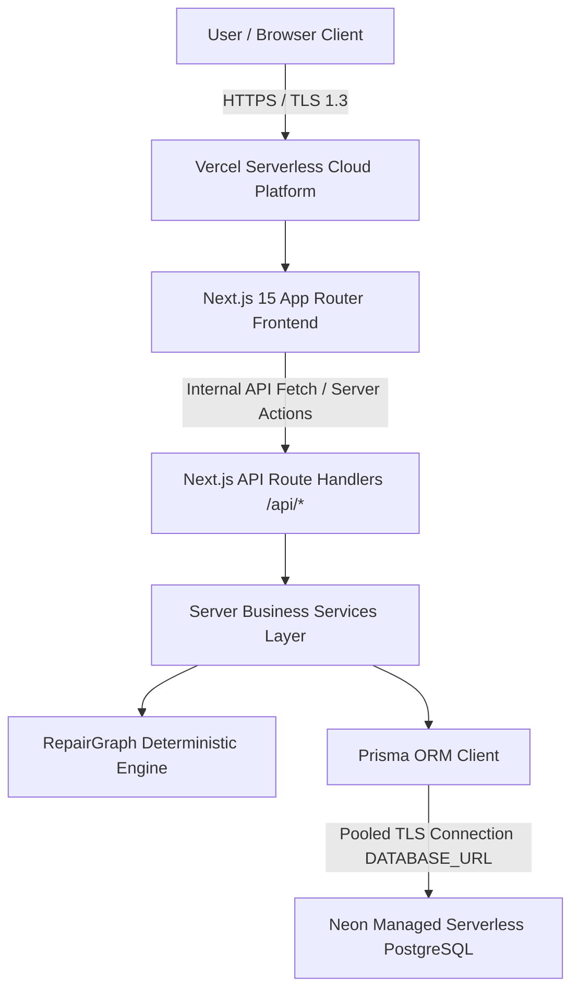
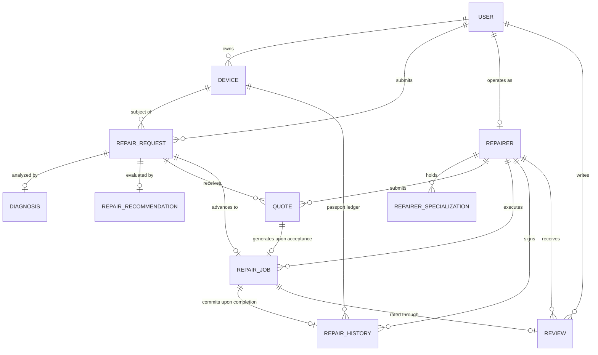

# RepairGraph Cloud Architecture, Engineering Specification & Production Evidence

**Project**: RepairGraph — Intelligent Product Repair & Lifecycle Platform  
**Author**: Naidu Reshmanth Sai  
**Registration Number**: 25BCE1112  
**Production URL**: [https://repairgraph.vercel.app](https://repairgraph.vercel.app)  
**Repository**: [https://github.com/reshmanth-sai/RepairGraph](https://github.com/reshmanth-sai/RepairGraph)  

---

## 1. Executive Summary

RepairGraph is an evidence-based product repair and hardware lifecycle management platform designed to help consumers, enterprise device fleets, and independent repair workshops evaluate repair economics, diagnose hardware failure modes, orchestrate competitive repair quotes, track active repair jobs, and maintain standardized product service passports.

The platform is aligned with India's **Right to Repair framework** (Department of Consumer Affairs) and statutory electronic waste mandates under the **E-Waste (Management) Rules, 2022**.

RepairGraph is deployed and verified in production using a **unified full-stack Next.js architecture on Vercel** backed by a **managed Neon serverless PostgreSQL database**. This document details the cloud computing topology, architecture decisions, assignment requirement mapping, API/backend engineering, relational schema, security perimeter, testing results, and live production evidence.

---

## 2. Cloud Architecture & Topology

RepairGraph employs a modern, unified cloud architecture where frontend presentation, API route handlers, server-side business services, and deterministic decision engines execute within a cohesive Next.js 15 serverless environment on Vercel, connecting over secure TLS to a managed cloud PostgreSQL database hosted on Neon.

### 2.1 Production Topology Diagram



### 2.2 Component Breakdown

```text
User / Browser Client
  │
  ▼
Vercel Serverless Runtime (Node.js 24.x) (https://repairgraph.vercel.app)
  ├── Next.js 15 App Router Frontend (React 19, Tailwind CSS v4)
  ├── REST API / Route Handlers (/api/*)
  ├── Authentication & Session Management (JWT in HttpOnly Cookies)
  ├── Server Business Services (Device, Request, Quote, Job, Review)
  └── RepairGraph Deterministic Diagnostic & Decision Engine
          │
        Prisma ORM Client (v6.4.1)
          │
          ▼ [Pooled TLS Connection / PgBouncer]
      Neon Serverless PostgreSQL (PostgreSQL 16)
```

1. **Frontend & Edge Delivery Layer**:
   - Built on Next.js 15 (App Router) and React 19.
   - Industrial editorial user interface styled with Tailwind CSS v4.
   - Static assets and pre-rendered pages are served via Vercel's global Anycast Edge Network with automated caching, TLS 1.3 termination, and DDoS defense.

2. **Backend & Serverless API Layer**:
   - Implemented as Next.js Route Handlers (`src/app/api/*`) executing within **Vercel Serverless Functions on the Node.js 24.x runtime** (not the restricted V8 Edge runtime, ensuring full native compatibility with Prisma ORM, bcrypt password hashing, and Node crypto APIs).
   - **Unified Architecture**: Both the frontend client and the backend REST API reside within the same codebase and deployment bundle, eliminating cross-origin resource sharing (CORS) overhead, extra network hops, and multi-service synchronization issues.
   - Layered architecture:
     - **Validators**: Schema enforcement via `zod`.
     - **Security**: JWT verification, HttpOnly cookie extraction, and in-memory rate limiting.
     - **Business Services**: Domain logic encapsulated in `src/server/services/*`.
     - **Deterministic Engine**: Mathematical scoring and statutory lifecycle categorization in `src/server/engine/*`.
     - **Data Access**: Type-safe relational database access via Prisma Client.

3. **Database Tier**:
   - Cloud-hosted serverless PostgreSQL 16 provided by **Neon**.
   - Connected via pooled connection strings (`DATABASE_URL`) utilizing connection pooling (PgBouncer) to support high-concurrency serverless executions without database connection exhaustion.
   - Direct connection string (`DIRECT_URL`) reserved for non-pooled administrative tasks and migration deployment.
   - Relational schema enforced with foreign keys, cascading deletions, unique constraints, and multi-column indexes.

4. **Secrets & Environment Isolation**:
   - Production secrets (`DATABASE_URL`, `JWT_SECRET`, etc.) are configured directly in the Vercel and Neon cloud dashboards.
   - No credentials, tokens, or connection strings are stored in version control or exposed to the client.

---

## 3. Assignment Requirements Mapping

The table below explicitly maps each cloud-computing project requirement to the verified implementation in RepairGraph:

| Cloud Computing Requirement | RepairGraph Implementation | Status & Evidence |
|---|---|---|
| **Cloud-based Application** | Full-stack application deployed on Vercel's serverless platform (Node.js 24.x runtime). Accessible worldwide at `https://repairgraph.vercel.app`. | Verified Live (HTTP 200 on production domain) |
| **CRUD Operations** | Complete Create, Read, Update, Delete functionality across physical devices, repair requests, quotes, active repair jobs, and customer reviews. | Verified via automated integration tests and live production acceptance testing |
| **Cloud-Hosted Database** | Managed cloud PostgreSQL instance on Neon with automated connection pooling and persistent relational storage. | Verified via active `SELECT 1` ping on `/api/health` returning `database: "connected"` |
| **RESTful APIs** | Next.js `/api/*` Route Handlers following REST conventions (21 route files, 36 HTTP method operations, RFC 7807 error format, standard status codes: 200, 201, 400, 401, 403, 404, 409, 429). | 21 verified route handlers across 10 resource namespaces |
| **Client-Server Communication** | Browser client dispatches authenticated HTTPS requests to Next.js API endpoints; route handlers validate payloads, invoke server services, query Prisma ORM, and return structured JSON. | Verified across all application user flows |
| **Cloud Deployment** | Vercel production deployment (Node.js 24.x serverless runtime) with continuous Git synchronization, automated builds, and edge TLS termination. | Production deployment live at `https://repairgraph.vercel.app` |
| **Database Persistence** | Prisma ORM with 11 normalized relational entities; data persists across browser sessions, re-logins, and serverless cold starts. | Verified via production multi-session acceptance test |
| **Authentication & Authorization** | JWT signed with HMAC-SHA256, transmitted via `HttpOnly`, `SameSite=lax`, `Secure` cookies; passwords hashed with `bcrypt` (10 rounds); role-based access control (`USER`, `REPAIRER`, `ADMIN`). | Verified with automated auth suites and production session tests |
| **Cloud Architecture** | Clean two-tier cloud architecture: Vercel serverless compute layer + Neon managed database tier with clear network perimeter. | Documented in topology diagrams and deployment runbook |
| **Comprehensive Testing** | 82 local automated tests (35 diagnostic engine unit tests + 47 business rule and security tests), ESLint validation, production build verification, and live production acceptance testing. | 82/82 tests passing (0 failures), ESLint clean (0 warnings) |

---

## 4. API & Backend Architecture

### 4.1 Request Processing Pipeline

Every API request flows through a strict, multi-stage processing pipeline before reading or modifying persistent state:

```text
1. Incoming Browser / HTTP Client Request
   │ (HTTPS request with cookies / headers)
   ▼
2. Vercel Global Edge Network
   │ (TLS 1.3 termination, Anycast routing, security headers applied)
   ▼
3. Vercel Serverless Runtime (Node.js 24.x)
   │ (Dispatches to Next.js Route Handler /api/*)
   ▼
4. Route Method Dispatch (GET, POST, PUT, DELETE)
   │
   │ (Sliding-window check on IP: 10 req/min login, 5 req/min register)
   ▼
5. Request Validation (Zod Schemas)
   │ (Strict typing and boundary constraints; returns 400 on error)
   ▼
6. Authentication & Authorization (src/server/auth/jwt.ts, cookies.ts)
   │ (Extracts rg_token cookie; validates HMAC-SHA256 signature; enforces role/ownership)
   ▼
7. Business Service Layer (src/server/services/*)
   │ (Encapsulates business rules, state machines, and calculations)
   │
   ├── [If Diagnostic Workflow] ──► Deterministic Engine (src/server/engine/*)
   │                                (7-Factor repairability scoring, RCR, E-Waste rules)
   ▼
8. Data Access Layer (Prisma Client - src/server/db.ts)
   │ (Constructs parameterized SQL queries preventing SQL injection)
   ▼
9. Neon Cloud PostgreSQL
   │ (Executes transaction, enforces foreign keys and unique constraints)
   ▼
10. Standardized JSON Response Formatter
    (Returns HTTP 200/201 with data envelope, or sanitized RFC 7807 error payload)
```

### 4.2 Verified Endpoint Catalog

The backend implements **21 Next.js route handler files (`route.ts`)** comprising **36 distinct HTTP method operations** (13 `GET`, 11 `POST`, 7 `PUT`, 5 `DELETE`) across 10 resource namespaces, fully active in production:

#### Authentication (`/api/auth`) — 4 Route Files, 4 Operations
- `POST /api/auth/register` — Creates user account with bcrypt password hashing and returns `HttpOnly` session cookie (`5 req/min` rate limit).
- `POST /api/auth/login` — Verifies credentials, issues JWT in `HttpOnly` cookie, and suppresses raw token from browser JSON payload (`10 req/min` rate limit).
- `POST /api/auth/logout` — Clears the `rg_token` session cookie.
- `GET /api/auth/me` — Returns the authenticated user's profile and role.

#### Device Catalog (`/api/devices`)
- `GET /api/devices` — Lists devices owned by the authenticated user (supports pagination and category filter).
- `POST /api/devices` — Registers a new physical device in the user's catalog.
- `GET /api/devices/:id` — Retrieves detailed device profile, repair requests, and service passport records (enforces ownership).
- `PUT /api/devices/:id` — Updates device condition, fair market value, or metadata (enforces ownership).
- `DELETE /api/devices/:id` — Deletes device and cascades to associated service records (enforces ownership).

#### Repair Requests (`/api/repair-requests`)
- `GET /api/repair-requests` — Lists repair requests for the authenticated user or open requests for technicians.
- `POST /api/repair-requests` — Files a new repair request against an owned device.
- `GET /api/repair-requests/:id` — Fetches request details, diagnostic findings, and competitive quotes.
- `PUT /api/repair-requests/:id` — Modifies request description or urgency.
- `DELETE /api/repair-requests/:id` — Cancels and removes an open request.
- `POST /api/repair-requests/:id/diagnose` — Invokes the deterministic diagnostic engine to generate triage signals, repairability scores, and statutory recommendations.

#### Competitive Quotes (`/api/repair-requests/:id/quotes` & `/api/quotes`)
- `GET /api/repair-requests/:id/quotes` — Lists incoming quotes for a request (consumers see all quotes; technicians see only their own).
- `POST /api/repair-requests/:id/quotes` — Allows a verified technician (`REPAIRER` role) to submit a competitive quote with cost and turnaround time.
- `GET /api/quotes/:id` — Retrieves specific quote details.
- `PUT /api/quotes/:id` — Accepts a quote (transitions quote to `ACCEPTED`, creates active `RepairJob`, and marks competing quotes `REJECTED`) or rejects/withdraws a quote.
- `DELETE /api/quotes/:id` — Withdraws a pending quote.

#### Repair Jobs & Lifecycle (`/api/repair-jobs`)
- `GET /api/repair-jobs` — Lists active jobs for the authenticated customer or assigned technician.
- `POST /api/repair-jobs` — Explicitly instantiates a repair job from an accepted quote.
- `GET /api/repair-jobs/:id` — Inspects repair job progress, milestones, and assigned technician.
- `PUT /api/repair-jobs/:id` — Updates job status through lifecycle state machine (`DIAGNOSING`, `WAITING_FOR_PART`, `REPAIRING`, `TESTING`, `COMPLETED`). Transitioning to `COMPLETED` automatically logs a permanent `RepairHistory` passport entry and updates technician metrics.

#### Standardized Repair Passport (`/api/repair-history`)
- `GET /api/repair-history` — Fetches the immutable, tamper-evident maintenance ledger for hardware serial numbers.

#### Technician Directory (`/api/repairers`)
- `GET /api/repairers` — Lists verified repair workshops with specializations, ratings, and location data.
- `POST /api/repairers` — Registers a repairer business profile for accounts with the `REPAIRER` role.
- `GET /api/repairers/:id` — Retrieves public workshop profile and specializations.
- `GET /api/repairers/:id/reviews` — Fetches paginated customer reviews and ratings for a repairer.

#### Customer Reviews (`/api/reviews`)
- `GET /api/reviews` — Lists reviews submitted across completed jobs.
- `POST /api/reviews` — Submits a star rating (1–5) and comment for a `COMPLETED` repair job (enforces customer ownership; prevents duplicate reviews).
- `GET /api/reviews/:id` — Retrieves a specific review.
- `PUT /api/reviews/:id` — Updates review text or rating.
- `DELETE /api/reviews/:id` — Deletes a review.

#### System Health & Observability (`/api/health`)
- `GET /api/health` — Executes an active database ping (`SELECT 1`), returning connection status, query latency in milliseconds, uptime, timestamp, and environment.

#### Development & Demonstration Utility (`/api/seed`)
- `POST /api/seed` — Seeds default test personas (`consumer@repairgraph.internal`, `technician@repairgraph.internal`, `admin@repairgraph.internal`) for controlled demonstrations.
- `GET /api/seed` — Inspects seed availability and status.

---

## 5. Database Architecture & Data Model

The production database is hosted on Neon PostgreSQL and managed via Prisma ORM. It comprises **11 normalized relational entities** designed to enforce relational integrity, prevent orphaned records, and guarantee consistent state transitions across the repair lifecycle.

### 5.1 Entity Relationship Diagram



### 5.2 Relational Entity Catalog (11 Models)

1. **`User`**: Account identities and credentials (`id`, `name`, `email` [Unique], `passwordHash` [bcrypt], `role` [`USER`, `REPAIRER`, `ADMIN`], `phone`, timestamps).
2. **`Device`**: Physical hardware registry (`id`, `userId` [FK], `category` [`SMARTPHONE`, `LAPTOP`, `TABLET`, `HEADPHONES`, `MONITOR`], `brand`, `model`, `serialNumber`, `purchaseDate`, `purchasePrice`, `warrantyExpiry`, `currentValue`, `condition`, `imageUrl`).
3. **`RepairRequest`**: Problem tickets (`id`, `deviceId` [FK], `userId` [FK], `description`, `urgency` [`LOW`, `MEDIUM`, `HIGH`], `status` [`REQUESTED`, `ACCEPTED`, `DIAGNOSING`, `WAITING_FOR_PART`, `REPAIRING`, `TESTING`, `COMPLETED`, `CANCELLED`]).
4. **`Diagnosis`**: Automated diagnostic findings (`id`, `repairRequestId` [1:1 FK], `issueCategory`, `possibleIssue`, `confidence` [0–100], `evidence` [String array]).
5. **`RepairRecommendation`**: Economic and statutory decision engine output (`id`, `repairRequestId` [1:1 FK], `repairabilityScore` [0–100], `economicScore` [0–100], `recommendedAction` [`REPAIR`, `DIY`, `REPLACE`, `RESELL`, `RECYCLE`], `estimatedCostMin`, `estimatedCostMax`, `reasoning`).
6. **`Repairer`**: Workshop business profiles (`id`, `userId` [1:1 FK], `businessName`, `description`, `address`, `latitude`, `longitude`, `verificationStatus` [`PENDING`, `VERIFIED`, `REJECTED`], `rating` [0.0–5.0], `totalJobs`).
7. **`RepairerSpecialization`**: Granular technical competencies (`id`, `repairerId` [FK], `deviceCategory`, `brand`, `serviceType`).
8. **`Quote`**: Competitive repair bids (`id`, `repairRequestId` [FK], `repairerId` [FK], `estimatedCost`, `estimatedDays`, `notes`, `status` [`PENDING`, `ACCEPTED`, `REJECTED`, `WITHDRAWN`]).
9. **`RepairJob`**: Active repair execution state machine (`id`, `repairRequestId` [1:1 FK], `repairerId` [FK], `quoteId` [1:1 FK], `status` [`ACCEPTED`, `DIAGNOSING`, `WAITING_FOR_PART`, `REPAIRING`, `TESTING`, `COMPLETED`, `CANCELLED`], `agreedCost`, `actualCost`, `startedAt`, `completedAt`, `notes`).
10. **`RepairHistory` (Repair Passport)**: Tamper-evident, immutable maintenance ledger linked to physical serial numbers (`id`, `deviceId` [FK], `repairJobId` [1:1 FK], `repairType`, `issue`, `partsReplaced` [String array], `cost`, `repairerId` [FK], `repairDate`, `verificationStatus`).
11. **`Review`**: Post-service customer evaluations (`id`, `repairJobId` [1:1 FK], `userId` [FK], `repairerId` [FK], `rating` [1–5], `comment`, timestamps).

### 5.3 Relational Invariants & Constraints

- **Foreign Key Cascades**: All child records link to parent entities via `onDelete: Cascade`, preventing dangling records upon account or device deletion.
- **Quote Uniqueness in Jobs**: `RepairJob.quoteId` is unique; a quote can produce at most one active job.
- **Single Active Job per Request**: `RepairJob.repairRequestId` is unique; only one quote may be accepted for a given repair ticket.
- **Single Review per Job**: `Review.repairJobId` is unique; prevents multiple reviews for the same service action.
- **Multi-Column Indexes**: High-frequency queries are indexed across `[userId]`, `[category]`, `[serialNumber]`, `[status]`, `[rating]`, and `[deviceCategory, brand]`.

---

## 6. CRUD Evidence Matrix

RepairGraph implements complete, verified CRUD functionality across domain entities:

| Domain Entity | Create (C) | Read (R) | Update (U) | Delete (D) |
|---|---|---|---|---|
| **Device Catalog** | `POST /api/devices`<br>(Register hardware with serial, purchase price, valuation) | `GET /api/devices`<br>`GET /api/devices/:id`<br>(List user devices, fetch device profile) | `PUT /api/devices/:id`<br>(Update condition, valuation, purchase details) | `DELETE /api/devices/:id`<br>(Cascade-delete device and related records) |
| **Repair Requests** | `POST /api/repair-requests`<br>(Submit symptom report for owned hardware) | `GET /api/repair-requests`<br>`GET /api/repair-requests/:id`<br>(Inspect ticket, diagnosis, quotes) | `PUT /api/repair-requests/:id`<br>(Update description, urgency, or status) | `DELETE /api/repair-requests/:id`<br>(Withdraw and remove open ticket) |
| **Technician Quotes** | `POST /api/repair-requests/:id/quotes`<br>(Specialist submits cost & turnaround bid) | `GET /api/repair-requests/:id/quotes`<br>`GET /api/quotes/:id`<br>(Review competing quotes) | `PUT /api/quotes/:id`<br>(Accept, reject, or withdraw quote) | `DELETE /api/quotes/:id`<br>(Withdraw submitted quote) |
| **Repair Jobs** | Instantiated automatically upon quote acceptance (`PUT /api/quotes/:id`) or via `POST /api/repair-jobs` | `GET /api/repair-jobs`<br>`GET /api/repair-jobs/:id`<br>(Track active bench progress) | `PUT /api/repair-jobs/:id`<br>(Advance lifecycle through testing to completion) | Handled via state machine cancellation (`JobStatus.CANCELLED`) |
| **Repair Passport** | Auto-created immutably upon job completion (`PUT /api/repair-jobs/:id` -> `COMPLETED`) | `GET /api/repair-history`<br>(Inspect tamper-evident service history by serial) | Immutable by design (tamper-evident audit ledger) | Retained with device lifecycle; cascades on device deletion |
| **Reviews** | `POST /api/reviews`<br>(Rate and review completed repair job) | `GET /api/repairers/:id/reviews`<br>`GET /api/reviews/:id`<br>(Inspect workshop ratings) | `PUT /api/reviews/:id`<br>(Edit rating and feedback) | `DELETE /api/reviews/:id`<br>(Remove review and recalculate average rating) |

---

## 7. Cloud Deployment Runbook (Vercel + Neon PostgreSQL)

The production deployment runs on Vercel connected to Neon PostgreSQL. The sequential runbook for deploying and verifying the application:

### Step 1: Provision Managed Database
1. Provision a serverless PostgreSQL instance on **Neon** (`postgresql://...`).
2. Obtain the **pooled connection string** (port 6543 / PgBouncer mode) for application runtime queries.
3. Obtain the **direct connection string** (port 5432) for running Prisma migrations.

### Step 2: Configure Production Secrets
Configure environment variable names in the Vercel Project Settings (Environment Variables):
- `DATABASE_URL` = `<Neon Pooled Connection String>`
- `DIRECT_URL` = `<Neon Direct Connection String>`
- `JWT_SECRET` = `<32+ Character Cryptographic Secret>`
- `JWT_EXPIRES_IN` = `7d`
- `NODE_ENV` = `production`
- `NEXT_PUBLIC_APP_URL` = `https://repairgraph.vercel.app`

### Step 3: Deploy Existing Prisma Migrations
Apply declarative schema migrations to the Neon database:
```bash
# Apply existing versioned migrations
npx prisma migrate deploy
```

> [!WARNING]
> **Production Migration Safety Rules:**
> - **DO NOT** use `npx prisma db push` in production. It bypasses migration history and risks unrecoverable schema divergence or data loss.
> - **DO NOT** use `npx prisma migrate dev` in production. It is interactive and meant solely for local development environments.

### Step 4: Build & Deploy Application
1. Trigger Vercel deployment via Git integration on `main` branch or via the Vercel CLI.
2. Vercel compiles the Next.js production bundle using:
   ```bash
   prisma generate && next build --turbopack
   ```
3. The serverless functions and static edge assets are deployed to the global Vercel CDN.

### Step 5: Post-Deployment Smoke Verification
1. **Health Ping**: Verify `GET https://repairgraph.vercel.app/api/health` returns HTTP 200:
   ```json
   {
     "success": true,
     "data": {
       "status": "ok",
       "service": "RepairGraph API",
       "database": "connected"
     }
   }
   ```
2. **Public Route Verification**: Confirm `/`, `/explore`, `/login`, `/register`, and `/diagnose` load with HTTP 200.
3. **Protected Endpoint Security Check**: Confirm `GET https://repairgraph.vercel.app/api/devices` returns HTTP 401 `UNAUTHENTICATED` when called without session cookies.
4. **Production Acceptance Verification**: Perform the non-destructive end-to-end acceptance test covering user registration, authentication, device registration, and diagnostic evaluation.

---

## 8. Environment Variables Specification

The platform utilizes environment variables to segregate configuration across development and production environments. **Only variable names are documented below; secret values are never committed to version control.**

| Variable Name | Scope | Sensitivity | Description |
|---|---|---|---|
| `DATABASE_URL` | Server Only | **Secret** | Pooled PostgreSQL connection string for Prisma ORM query execution. |
| `DIRECT_URL` | Server Only | **Secret** | Direct (non-pooled) PostgreSQL connection string for Prisma schema migrations. |
| `JWT_SECRET` | Server Only | **Secret** | 256-bit cryptographic key used for HMAC-SHA256 signing and verification of user session tokens. |
| `JWT_EXPIRES_IN` | Server Only | Configuration | Token validity duration string (default: `7d`). |
| `PORT` | Server Only | Configuration | Local execution port (default: `3000`). |
| `NODE_ENV` | Server Only | Configuration | Runtime execution environment (`development`, `test`, `production`). |
| `NEXT_PUBLIC_APP_URL` | Public / Client | Configuration | Canonical public URL used for absolute redirects and client metadata (`https://repairgraph.vercel.app`). |

---

## 9. Security Controls & Defensive Engineering

RepairGraph implements security controls across every architectural layer:

1. **Session & Cookie Security**:
   - Authentication tokens are transmitted exclusively in `HttpOnly` cookies (`rg_token`).
   - `SameSite=lax` prevents cross-site request forgery (CSRF) in standard navigation.
   - The `Secure` flag is enforced automatically in production environments (`NODE_ENV === 'production'`).
   - Raw JWT tokens are suppressed from JSON response bodies during browser login and registration to prevent XSS credential harvesting from `localStorage` or `sessionStorage`.

2. **Password Hashing**:
   - Passwords are salted and hashed using `bcrypt` with 10 rounds prior to database persistence.

3. **In-Memory Rate Limiting** (`src/server/auth/rateLimit.ts`):
   - Sliding-window rate limiter protects authentication routes against brute-force attacks:
     - Login: Maximum 10 requests / minute per client IP.
     - Registration: Maximum 5 requests / minute per client IP.
   - Exceeded limits return HTTP 429 `RATE_LIMIT_EXCEEDED` with a `Retry-After` header.

4. **Input Validation & Sanitization**:
   - All route handlers enforce schema boundaries using `zod`. Malformed payloads, unexpected fields, or invalid types are rejected with HTTP 400 before service execution.

5. **Insecure Direct Object Reference (IDOR) Protection**:
   - Service layers verify resource ownership against the authenticated user ID (`User.id`) before permitting read, update, or delete operations on devices, requests, quotes, jobs, and reviews.

6. **Production Security Headers** (`next.config.ts`):
   - `Strict-Transport-Security: max-age=31536000; includeSubDomains` (HSTS)
   - `X-Frame-Options: DENY` (Clickjacking prevention)
   - `X-Content-Type-Options: nosniff` (MIME-type sniffing prevention)
   - `X-XSS-Protection: 1; mode=block`
   - `Referrer-Policy: strict-origin-when-cross-origin`
   - `Permissions-Policy: camera=(), microphone=(), geolocation=()`

7. **Error Sanitization**:
   - Production error handlers catch unexpected database exceptions and return generic, actionable messages, suppressing internal SQL queries, Prisma engine details, and stack traces.

---

## 10. Production Evidence & Verification

RepairGraph is live, deployed, and verified in production.

### 10.1 Live Environment Details
- **Production URL**: `https://repairgraph.vercel.app`
- **Hosting Platform**: Vercel Serverless Platform
- **Database**: Neon Managed Cloud PostgreSQL
- **Migration Status**: Prisma migration `0_init` applied cleanly

### 10.2 Live Health Check Verification
A real-time health check against the production deployment confirms end-to-end database connectivity and telemetry:

```http
GET https://repairgraph.vercel.app/api/health
HTTP/2 200 OK
content-type: application/json
strict-transport-security: max-age=31536000; includeSubDomains
x-content-type-options: nosniff
x-frame-options: DENY
x-xss-protection: 1; mode=block
referrer-policy: strict-origin-when-cross-origin
server: Vercel

{
  "success": true,
  "data": {
    "status": "ok",
    "service": "RepairGraph API",
    "database": "connected",
    "latencyMs": 3269,
    "uptime": 3,
    "timestamp": "2026-09-12T16:10:04.310Z",
    "environment": "production"
  }
}
```

### 10.3 Protected Endpoint Verification
An unauthenticated request against the protected `/api/devices` endpoint confirms authorization enforcement on the live domain:

```http
GET https://repairgraph.vercel.app/api/devices
HTTP/2 401 Unauthorized
content-type: application/json
server: Vercel

{
  "error": {
    "code": "UNAUTHENTICATED",
    "message": "Authentication required. Missing authorization token.",
    "details": []
  }
}
```

### 10.4 Production Functional Acceptance Flow
The complete user lifecycle was validated against the live production deployment:

```text
1. User Registration (POST /api/auth/register)
   └── Account created with role USER; secure session cookie set
2. User Authentication (POST /api/auth/login)
   └── Login succeeded; HttpOnly session established; raw JWT suppressed
3. Device Registration (POST /api/devices)
   └── Hardware cataloged with brand, model, serial number, and valuation
4. Problem Report & Triage (POST /api/repair-requests)
   └── Symptom ticket filed and linked to physical device
5. Deterministic Diagnosis & Recommendation (POST /api/repair-requests/:id/diagnose)
   └── 7-factor repairability score, RCR economic math, and lifecycle action computed
6. Service Passport Ledger (GET /api/repair-history)
   └── Historical maintenance records verified and linked to device serial
7. Persistence Across Sessions
   └── User logged out (POST /api/auth/logout)
   └── User logged in again (POST /api/auth/login)
   └── Registered device, diagnosis, and passport data retrieved intact from Neon PostgreSQL
```

---

## 11. Testing & Quality Assurance Documentation

The project maintains comprehensive test coverage across unit, integration, static analysis, and live production tiers:

### 11.1 Test Execution Summary

| Test Suite | Scope | Executable Command | Test Count | Result |
|---|---|---|---|---|
| **Deterministic Engine** | Unit tests for 7-factor scoring, RCR math, hazard detection, and statutory rules | `npx tsx tests/engine.test.ts` | 35 tests | **35 Passed, 0 Failed** |
| **Backend & Business Rules** | Integration tests for auth, rate limiting, device CRUD, quote workflows, job stepper, and permissions | `npx tsx tests/api.test.ts` | 47 tests | **47 Passed, 0 Failed** |
| **Total Automated Tests** | Combined automated test suite | `npm test` | **82 tests** | **82 Passed, 0 Failed** |
| **Static Code Quality** | ESLint linting rules across all TypeScript files | `npm run lint` | Full codebase | **0 Errors, 0 Warnings** |
| **Production Build** | Full Next.js production compilation and type checking | `npm run build` | Full codebase | **Build Successful** |
| **Production Smoke Tests** | Live HTTP, security header, and database connectivity checks | `npx tsx scripts/smoke-test.ts` | Production URL | **Verified Live** |
| **Production E2E Acceptance** | Multi-step user lifecycle test against live production deployment | Phase 7C.3 Acceptance Runner | 6 Stages | **All 6 Stages Passed** |

### 11.2 Automated Test Count Audit & Progression

To guarantee complete consistency across college submissions and technical reports, the automated test suite count is audited below directly from source:

1. **Diagnostic & Decision Engine Suite (`tests/engine.test.ts`)**: **35 unit tests** (100% deterministic, 0 failures)
   - *Suite 1: Rule-Based Symptom & Feature Extraction*: 13 tests (token boundary parsing, hardware categorization, liquid ingress detection, lithium swelling hazard flags).
   - *Suite 2: 7-Factor Score Model & Economic Math*: 13 tests (factor weights summing to 100, RCR calculation, economic score scaling, penalty deductions).
   - *Suite 3: Statutory Lifecycle Decision Matrix*: 9 tests (DIY, REPAIR, RESELL, REPLACE, RECYCLE actions and E-Waste Rules 2022 citations).

2. **Backend & Business Rule Suite (`tests/api.test.ts`)**: **47 integration tests** (100% passed, 0 failures)
   - *Core Business Rules & Authorization Boundaries*: 24 tests (user registration, password hashing, device ownership, quote flow, workbench job stepper, review invariants).
   - *Step 6 Hardening Verification*: 18 tests (safe redirects, segment-aware navigation, UI score sanitization, action bridges, technician filter honesty, passport data isolation, ARIA accessibility standards). Baseline count: **42 tests**.
   - *Step 7C.2 Registration Validation Additions*: 4 tests (short password rejection, invalid email rejection, multi-error extraction, database/Prisma leak suppression). Subtotal count: **46 tests**.
   - *Step 7C.2 Demo Persona Provisioning Verification*: 1 test (`Demo Provisioning: Admin and demo persona login succeeds with Password123!`). Verified total: **47 tests**.

3. **Grand Total**: **82 automated tests** across both suites (**82 Passed, 0 Failed**).

> [!NOTE]
> **Resolution of Earlier Test Count References:**
> Earlier milestone notes citing `46/46` tests reflected the business rule test count prior to appending the demo persona provisioning verification test in Phase 7C.2. The actual, verified test count across the entire repository is **47 non-engine tests + 35 engine tests = 82 automated tests**, all executing cleanly in under 3 seconds.

---

## 12. Cloud Cost & Free-Tier Documentation

RepairGraph is engineered to operate efficiently within cloud provider hobby/free tiers for demonstration and academic evaluation:

- **Vercel Hobby Tier**:
  - Provides free serverless execution, continuous deployment, and global edge CDN caching.
  - Subject to Vercel's personal hobby plan limits (bandwidth, serverless function invocation duration, and monthly execution limits).
- **Neon Serverless PostgreSQL Free Tier**:
  - Provides a managed PostgreSQL database with 0.5 GiB storage and shared compute vCPU.
  - Includes automated connection pooling (PgBouncer) and compute scale-to-zero when idle.
- **Cost Disclaimer**:
  - Cloud provider free-tier terms, bandwidth allocations, and storage quotas are subject to provider policy changes.
  - The project does **not** claim a guaranteed perpetual ₹0 production cost.
  - In a continuous production environment, resource consumption and billing alerts must be monitored directly within the Vercel and Neon management consoles.

---

## 13. System Limitations

In adherence to the documentation accuracy rule, the following operational characteristics and limitations are explicitly noted:

1. **In-Memory Rate Limiting**: The sliding-window rate limiter (`src/server/auth/rateLimit.ts`) maintains state in serverless process memory. While effective against single-instance bursts, cold starts or distributed multi-region serverless invocations reset the local counter. A distributed Redis-based limiter is planned for high-concurrency production.
2. **Academic & Demonstration Scale**: The platform is sized and configured for portfolio demonstration and academic evaluation, not hyperscale enterprise workloads.
3. **Synchronous Request Processing**: Diagnostic and economic evaluations execute deterministically in sub-millisecond time (`< 1 ms`), allowing synchronous execution within the request-response lifecycle without a dedicated asynchronous task queue (e.g., Celery or BullMQ).
4. **Cloud Observability**: Telemetry relies on native Vercel runtime logs, the active `/api/health` ping endpoint, and Neon console database metrics rather than an external third-party APM suite (e.g., Datadog, New Relic).
5. **Non-Destructive Production Testing**: Production smoke tests and acceptance suites are strictly non-destructive; database reset tests (`db seed` or table drops) are reserved for local development.
6. **Preferred Specialist Selection**: Selecting a preferred technician during triage provides contextual information for subsequent quoting, but does not create an immutable binding assignment prior to quote acceptance.

---

## 14. Scalability & Future Engineering Roadmap

The current architecture provides a clean foundation for horizontal scaling. Future enhancements for enterprise-grade workloads include:

1. **Distributed Rate Limiting & Token Revocation**: Implementing Upstash Serverless Redis for distributed rate limiting, session invalidation, and real-time token blacklisting.
2. **Asynchronous Background Processing**: Introducing a dedicated message queue (e.g., BullMQ or AWS SQS) for processing bulk enterprise hardware fleet imports and PDF service passport generation.
3. **Enterprise APM & Tracing**: Integrating OpenTelemetry and distributed tracing to monitor serverless latency and database connection pool saturation.
4. **Database Optimization**: Introducing read replicas for high-throughput public technician directory queries and implementing vector embeddings (`pgvector`) for semantic search across OEM repair schematics.
5. **Automated CI/CD**: Adding GitHub Actions workflows for automated linting, test suite execution, and preview deployment verification on every pull request.

---

## 15. Viva-Ready Cloud Explanation

Concise technical answers for academic defense and evaluation:

### Why Vercel?
RepairGraph is built as a Next.js full-stack application. Vercel provides first-class native support for Next.js 15 (App Router), serverless Route Handlers, automatic Edge TLS termination, and worldwide CDN distribution without the complexity of managing Kubernetes clusters, virtual machines, or manual reverse proxies.

### Why Neon?
RepairGraph requires an enterprise relational database with ACID guarantees, foreign keys, and Prisma ORM compatibility. Neon provides managed cloud PostgreSQL with serverless auto-scaling and built-in connection pooling (PgBouncer), allowing serverless Next.js functions to execute concurrent queries without exhausting database connections.

### Why no separate backend (e.g., separate Express/Render service)?
Next.js is a full-stack framework that includes production-grade server Route Handlers (`/api/*`). Housing the frontend and backend in a unified Next.js architecture eliminates cross-origin resource sharing (CORS) overhead, prevents multi-repository drift, consolidates environment configuration, reduces deployment latency, and avoids maintaining an unnecessary second cloud hosting service.

### How does the client communicate with the backend?
The browser client sends standard HTTPS requests to Next.js `/api/*` Route Handlers. The handler authenticates the request via `HttpOnly` JWT cookies, validates input using Zod schemas, executes domain logic in server business services, runs the deterministic engine where required, and queries Neon PostgreSQL through Prisma ORM before returning structured JSON responses.

### Why is this a cloud application?
Because both the application compute runtime (Vercel Serverless) and the persistent relational database (Neon PostgreSQL) are hosted on managed cloud infrastructure, accessible globally via a secure public HTTPS endpoint (`https://repairgraph.vercel.app`), with environment-isolated secrets and automated cloud scalability.

---

## 16. Submission-Ready Academic Summary

- **Project Title**: RepairGraph: Intelligent Product Repair & Lifecycle Platform
- **Student Name**: Naidu Reshmanth Sai
- **Registration Number**: 25BCE1112
- **Problem**: Fragmented electronic repair ecosystems, lack of diagnostic transparency, unverified technician quotes, absence of standardized device maintenance records, and premature hardware disposal exacerbating e-waste.
- **Solution**: A cloud-native platform providing rule-based diagnostic triage, transparent 7-factor repairability scoring, economic repair-vs-replace formulas, competitive technician quote orchestration, and a standardized, tamper-evident device service passport aligned with India's Right to Repair framework and E-Waste Rules, 2022.
- **Cloud Stack**: Next.js 15 (App Router), React 19, Tailwind CSS v4, Vercel Serverless Runtime (Node.js 24.x), Neon Managed Cloud PostgreSQL, Prisma ORM, bcrypt, and JWT.
- **Database**: 11 normalized relational entities in PostgreSQL with ACID transactional integrity, connection pooling, and cascading constraints.
- **Security**: JWT in HttpOnly/Secure/SameSite cookies, sliding-window rate limiting, Zod validation, IDOR ownership checks, and strict production HTTP security headers.
- **Verification**: 82 automated test cases passing (0 failures), ESLint clean, and complete production functional acceptance flow verified live.
- **Production URL**: [https://repairgraph.vercel.app](https://repairgraph.vercel.app)
